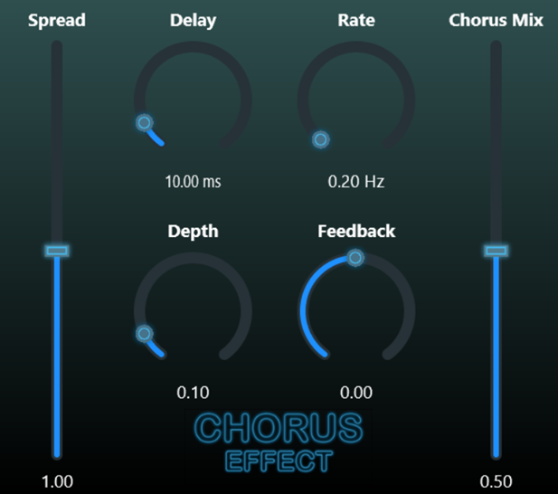

# Chorus Effect - VST made with JUCE

The follow repository contains the source code and the executable of a simple chorus effect VST plugin made with JUCE.

## Context

This VST plugin was developed to train myself in the use of the JUCE framework. 
It has no algorithmic ambition; it is simply built using JUCE modules.

## About the VST plugin

This VST has six parameters:
- **Delay**: the center delay of the chorus effect (in ms)
- **Rate**:  the modulation rate of the LFO, in Hz.
- **Depth**:  the modulation volume of the LFO applied to the delay.
- **Feedback**: the amount of feedback added to the chorus effect (can be used to have a flanger effect)
- **Chorus mix**: mix between the wet (processed) and dry (original) signals
- **Spread**: for a stereo signal, a spread of 0 yields a mono signal, a spread of 1 represents the original stereo spread, and a spread greater than 1 provides expanded stereo.

This module can serve as a traditional chorus effect, and it can also be employed as a flanger effect (through manipulation of the feedback parameter) or a vibrato effect (by utilizing the rate parameter with the mix set to one, outputting only the wet signal).

